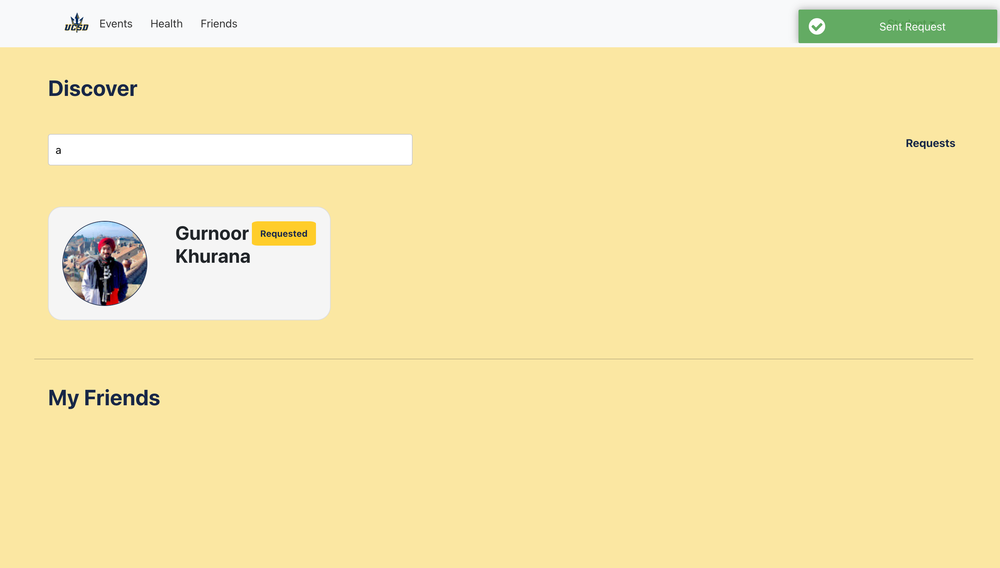

# Take-a-Break

Take-a-Break is a campus events application that consolidates information from various communities, clubs, and support services. The aim is to alleviate student stress and foster social connectivity by providing a centralized platform for social events discovery and registration. The application also intends to streamline access to UCSD health resources from Student Health Services (SHS) and CAPS.

# Using the Application
To start using the application, you can just login through Google OAuth with your UCSD Email ID. 


After successful login, you are redirected to the Events Page, where you can navigate the various events, Search for any event, as well as filter any event based on categories like Free food, Mental and Physica Wellness, Graduate/ Undergraduate etc. 


To get a detailed view of any event, you can click on an event to view more details. You can also RSVP for any event, and the event organiser will get your details, and you can attend the event.


You can also make friends on the application and by Sending friend requests to other users. Once the other user accepts your request, you will be friends on the application, and you would be able to see which of you friends are attending which events.



# Starting Up the Project

To start the project, you need to find the setup.sh file and run it.

### For Windows user:

To run the script on Windows, you can use the Windows Subsystem for Linux (WSL), which provides a Linux-compatible environment within Windows. Here's how you can do it:

1.**Install WSL**: If you haven't already, install WSL by following the instructions provided by Microsoft: Install WSL.

2.**Install a Linux Distribution**: After installing WSL, you need to install a Linux distribution from the Microsoft Store. Ubuntu is a popular choice. You can search for "Ubuntu" in the Microsoft Store and install it.

3.**Open Ubuntu (or your chosen Linux distribution)**: Once installed, launch the Ubuntu app from the Start menu or by searching for "Ubuntu" in the search bar. This will open a terminal window within the Linux environment.

4.**Navigate to the Script Directory**: Use the cd command to navigate to the directory where your script (setup.sh) is located. For example:

```cd /mnt/c/path/to/your/script/directory```

Replace /mnt/c/path/to/your/script/directory with the actual path to the directory where your script is located. Note that Windows drives are mounted under /mnt, so you'll need to navigate to the appropriate location accordingly.

5.**Run the Script**: Once you're in the directory containing the script, execute it by running:

./setup.sh

This will run the script using the Bash interpreter provided by WSL.

The script will execute within the Linux environment provided by WSL, allowing you to perform the Docker-related setup steps as defined in your script. Ensure that you have Docker installed and configured within WSL as well.

The config.sh file should be present in both the frontend and backend directories, and contain the appropriate environment variables in each directory.

Alternatively, if you prefer not to use WSL, you can use Git Bash or Cygwin, both of which provide a Unix-like environment on Windows. You can follow similar steps within those environments to execute the script.

6.**Tips**: If you are facing a problem of 'syntax error: unexpected end of file', try to check if the file is in unix type.

### For Mac user:

On macOS, you can run the script directly in the Terminal, as macOS is Unix-based and supports Bash scripting. Here's how to do it:

1.**Open Terminal**: Launch the Terminal application on your Mac. You can find it in the "Utilities" folder within the "Applications" directory, or you can use Spotlight search by pressing Command + Space and typing "Terminal".

2.**Navigate to the Script Directory**: Use the cd command to navigate to the directory where your script (setup.sh) is located. For example:

```cd /path/to/your/script/directory```

Replace /path/to/your/script/directory with the actual path to the directory where your script is located.

3.**Make the Script Executable (if necessary)**: If the script is not already executable, make it executable by running:

chmod +x setup.sh
4.**Run the Script**: Once you're in the directory containing the script, execute it by running:

./setup.sh
This will run the script using the Bash interpreter in your Terminal session.


